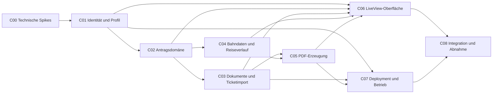

# Umsetzungsplan Fahrgastrechte

> **Dokumentstatus:** historische Planungs- und Abnahmereferenz. Der aktuelle
> Systemvertrag steht in der [technischen Übersicht](../architecture.md), den
> [Kontextschnittstellen](../interfaces/README.md) und der
> [Refactoring-Roadmap](../refactoring-roadmap.md).

## Aktueller Stand

Stand: 30. Juli 2026

Die Komponenten C00 bis C05 sind als Fachbasis implementiert. C06 stellt
Dashboard, Profil und den vollständigen Sechs-Schritt-Assistenten bereit. Die
Wellen 2 bis 6 verbinden Authentik, fortsetzbare Bearbeitung, Dokumentprüfung,
Bahnhofssuche, manuellen Reiseeditor, tatsächliche Timeline, Prüfseite,
versionierte PDF-Ausgaben und Statusverfolgung zu einer durchgängigen
Antragsstrecke. Die softwareseitigen Qualitätsmaßnahmen aus Welle 7 sind
umgesetzt; Druckprobe und praktische Produktionsabnahme bleiben
umgebungsabhängig offen.

Der priorisierte Ausbau ab diesem Stand ist im
[`Ausbauplan nach Wellen`](waves.md) beschrieben. Die folgenden
Komponentenaufträge bleiben als Architektur- und Abnahmereferenz erhalten; ihre
ursprüngliche Reihenfolge beschreibt nicht mehr den aktuellen Arbeitsstand.

## Ziel und MVP-Grenze

Die private Webanwendung unterstützt zwei über Authentik angemeldete Personen
dabei, Fahrgastrechte-Anträge für deutsche DB-Flexpreis-Reisen zu erstellen.
Jede Person sieht ausschließlich die eigenen Stammdaten, Reisen, Dokumente und
Anträge.

Der Kernablauf ist:

1. DB-Ticket und DB-Rechnung als PDF hochladen.
2. Erkannte Reisedaten prüfen und eine Verbindung auswählen.
3. Verspätung, Ausfall und gegebenenfalls eine Ersatzverbindung erfassen.
4. Das offizielle DB-Fahrgastrechteformular ausfüllen.
5. Deckblatt, Formular, Ticket und Rechnung als ein druckfertiges PDF erzeugen.
6. Den Antrag über `Entwurf`, `Druckfertig`, `Versendet` und `Erledigt`
   verfolgen.

Nicht Bestandteil des MVP sind Anspruchsberechnung, Entschädigungsberechnung,
Zusatzkosten, OCR, mehrere Reisende pro Antrag, andere Verkehrsunternehmen oder
eine direkte digitale Übermittlung an die Deutsche Bahn.

## Verbindliche Produktentscheidungen

- Phoenix 1.8, LiveView, PostgreSQL und Tailwind CSS bleiben der bestehende Stack.
- Authentik authentifiziert über OIDC. Zoraxy übernimmt TLS und Reverse Proxy,
  nicht die fachliche Benutzerzuordnung.
- Die stabile Benutzeridentität ist das Paar aus OIDC-Issuer und `sub`-Claim,
  nicht die veränderliche E-Mail-Adresse.
- Ein Benutzer besitzt genau ein eigenes Reisendenprofil.
- IBAN, BIC und alle hochgeladenen PDFs gelten als sensible Daten.
- Es werden ausschließlich PDF-Uploads angenommen.
- Ticket und DB-Rechnung werden getrennt hochgeladen.
- API-Daten sind Vorschläge, müssen bestätigt werden und bleiben editierbar.
- Fehlende historische Ist-Daten blockieren den Antrag nicht.
- Normalisierte Fahrplandaten und der API-Snapshot werden am Antrag gespeichert.
- Die Entschädigungsart ist Überweisung.
- Das Unterschriftsfeld bleibt in der Ausgabe leer.
- Die Ausgabe enthält Deckblatt, offizielles Formular, Ticket und Rechnung.
- Anträge und Dokumente bleiben bis zur ausdrücklichen Löschung erhalten.
- Es gibt keine geteilten Anträge und keine administrative Fremdeinsicht.

## Architektur- und Kontextgrenzen

```text
Browser
  │
  ▼
Zoraxy / TLS ──► Phoenix LiveView ──► Authentik / OIDC
                         │
                         ├──► PostgreSQL
                         ├──► geschützter Dokumentenspeicher
                         ├──► isoliertes PDF-Backend
                         └──► DB API über Req
```

Verbindliche Elixir-Kontexte:

- `Fahrgastrechte.Accounts`: OIDC-Benutzer und Reisendenprofil
- `Fahrgastrechte.Claims`: Antrag, Status und Statushistorie
- `Fahrgastrechte.Documents`: Originale und generierte Dokumente
- `Fahrgastrechte.Tickets`: Extraktion und Vorschläge aus Ticket/Rechnung
- `Fahrgastrechte.Rail`: geplante und tatsächliche Reiseverläufe
- `Fahrgastrechte.Rail.Provider`: austauschbare Fahrplandatenquelle
- `Fahrgastrechte.Exports`: Formular, Deckblatt und Gesamt-PDF

Eine Komponente greift nicht direkt auf Tabellen einer anderen Komponente zu,
sondern verwendet deren öffentliche Funktionen. Jede benutzerbezogene Funktion
erhält einen `current_scope`. Eine ungescopte Primär-ID allein reicht nie zum
Lesen, Ändern oder Herunterladen.

## Komponenten und Abhängigkeiten



| ID | Komponente | Ergebnis | Start nach |
| --- | --- | --- | --- |
| C00 | Technische Spikes | Entscheidungen für DB API, Ticket und PDF | sofort |
| C01 | Identität und Profil | OIDC, Datentrennung, Stammdaten | C00 |
| C02 | Antragsdomäne | Antrag, Status und Statushistorie | C01 |
| C03 | Dokumente und Ticketimport | PDF-Speicher und Datenvorschläge | C02 |
| C04 | Bahndaten und Reiseverlauf | Verbindung, Soll-/Ist-Daten, Korrektur | C02 |
| C05 | PDF-Erzeugung | versioniertes druckfertiges Gesamt-PDF | C03, C04 |
| C06 | LiveView-Oberfläche | Dashboard, Assistent, Autosave | C01–C05 |
| C07 | Deployment und Betrieb | Proxmox, Zoraxy, Backup, Betrieb | C01, C03, C05 |
| C08 | Integration und Abnahme | E2E-, Sicherheits- und Betriebsabnahme | C06, C07 |

Empfohlene Arbeitswellen:

1. C00 zuerst abschließen.
2. C01 und danach C02 legen Identitäts- und Domänengrenzen fest.
3. C03 und C04 können parallel von getrennten Agenten bearbeitet werden.
4. C05 beginnt nach stabilen Dokument- und Reiseschnittstellen; C07 kann
   parallel vorbereitet werden.
5. C06 verbindet die Fachkomponenten zum Nutzerablauf.
6. C08 schließt Integration und Abnahme ab.

## C00 – Technische Spikes

### Auftrag

Externe und dokumentbezogene Risiken werden mit kleinen Versuchen geklärt. Das
Ergebnis sind dokumentierte Entscheidungen und synthetische Fixtures, keine
Produktionsfunktion.

### Zu klären

- Mit dem vorhandenen DB-API-Zugang verfügbare Produkte und Endpunkte
- Bahnhofssuche, Sollfahrplan, Zuglauf, Ausfall und Ist-/Prognosezeiten
- praktisches Historienfenster, Rate-Limits, Lizenzen und stabile IDs
- direkte Start-Ziel-Suche oder Rekonstruktion aus Ticket und Bahnhofstafeln
- Textauslesbarkeit typischer Ticket- und Rechnungs-PDFs
- zuverlässig erkennbare Ticketfelder und Flexpreis-Varianten
- AcroForm-Felder oder Koordinaten-Overlay im offiziellen Formular
- Werkzeug für Textgewinnung, Flattening, Bereinigung und PDF-Merge
- sicherer Dokumentenspeicher und Ressourcenlimits

### Ergebnisse

- Decision Records unter `docs/decisions/`
- ausschließlich synthetische oder vollständig anonymisierte PDF-Fixtures
- API-Beispiele ohne Credentials oder personenbezogene Daten
- festgelegte Behaviours für Rail-Provider, Ticketextraktion und PDF-Backend

### Definition of Done

- Ein Ticket-Beispiel wird reproduzierbar in Text überführt.
- Das Formular wird synthetisch befüllt und mit zwei PDFs zusammengeführt.
- Ein authentifizierter DB-API-Testaufruf ist dokumentiert.
- Historienfenster und manueller Ersatzweg sind festgehalten.
- Keine echten Dokumente oder Geheimnisse liegen im Repository.

## C01 – Identität und Reisendenprofil

### Auftrag und Eigentum

Der Agent besitzt OIDC-Flow, lokale Benutzerzuordnung, `current_scope`,
geschützte Routen, Accounts-Kontext und Profilpflege.

### Daten und Regeln

- Benutzer: OIDC-Issuer, Subject, nicht autoritative E-Mail und Anzeigename
- eindeutiger Index auf `(issuer, subject)`
- Profil: Anrede, Titel, Name, Anschrift, Staat, optionale Telefonnummer
- Profil: Kontoinhaber, IBAN und BIC
- IBAN und BIC werden nicht geloggt und nach der C00-Entscheidung verschlüsselt.
- Session-Cookies sind `Secure`, `HttpOnly` und passend `SameSite`-geschützt.
- Issuer, Signatur, Audience, Ablaufzeit, State und Nonce werden geprüft.

### Öffentliche Schnittstelle

`Fahrgastrechte.Accounts` kann eine validierte Identität finden/anlegen, das
eigene Profil laden und aktualisieren sowie dessen Vollständigkeit prüfen.

### Tests und Definition of Done

- Erstlogin, Wiederholungslogin und Logout
- ungültige Claims, State, Nonce, Signatur oder Audience werden abgelehnt
- gleiche E-Mail mit anderem Subject erzeugt keine falsche Zuordnung
- Benutzer A kann Profil B nicht lesen oder ändern
- `current_scope` steht in Controller und authentifizierter `live_session` bereit
- `mix precommit` ist erfolgreich

Vorgeschlagener Branch: `agent/c01-identity-profile`.

## C02 – Antragsdomäne und Status

### Auftrag und Eigentum

Der Agent besitzt Claims-Kontext, Antragsschema, Statusübergänge,
Statushistorie, Vollständigkeitsprüfung und Löschkoordination. Er implementiert
keine Upload-, DB-API- oder PDF-Logik.

### Statusmodell

- `draft` – Entwurf
- `ready` – druckfertig
- `sent` – versendet
- `completed` – erledigt

Erlaubte Übergänge sind `draft → ready → sent → completed`. Eine bewusste
Korrektur kann `ready` oder `sent` auf `draft` zurücksetzen. Jede relevante
Änderung invalidiert eine aktuelle Ausgabe atomar.

### Antragsdaten

- nicht erratbare ID und menschenlesbare Antragsnummer
- Benutzerzuordnung, Status, Reisedatum, Start und Ziel
- Störungsart `delay` oder `cancellation`
- Entschädigungsart fest auf Überweisung
- Erzeugungs-, Versand- und Abschlusszeitpunkte
- Absicherung gegen verlorene konkurrierende Autosaves

### Öffentliche Schnittstelle

`Fahrgastrechte.Claims` bietet ausschließlich gescopte Funktionen zum Anlegen,
Laden, Auflisten, Ändern, Löschen, Filtern und für Statusübergänge. Fehler zur
Exportvollständigkeit werden strukturiert zurückgegeben.

### Tests und Definition of Done

- alle erlaubten und unerlaubten Übergänge
- vollständige Statushistorie
- Änderung setzt `ready` auf `draft`
- Filter nach Status, Datum, Strecke und Antragsnummer
- Benutzer A kann Antrag B nicht laden, ändern oder löschen
- dokumentierte API für C03 bis C06
- `mix precommit` ist erfolgreich

Vorgeschlagener Branch: `agent/c02-claims-domain`.

## C03 – Dokumente und Ticketimport

### Auftrag und Eigentum

Der Agent besitzt sicheren PDF-Upload, Metadaten, physischen Speicher,
autorisierte Downloads, Löschung, Textgewinnung und Ticketvorschläge.

### Dokumentarten und Regeln

- Originalarten `ticket` und `invoice`
- generierte Arten `generated_cover`, `generated_form`, `generated_bundle`
- Prüfung von PDF-Signatur und MIME-Typ
- konfigurierbare Größen- und Seitenbegrenzung
- zufälliger interner Name, SHA-256 und Originalname nur als Metadatum
- kein öffentlicher Dateipfad; jeder Download prüft Scope und Eigentum
- genau ein aktuelles Ticket und eine aktuelle Rechnung pro Antrag
- kein OCR: textlose PDFs führen zum manuellen Ersatzweg

### Ticketvorschläge

Vorschläge enthalten Wert, Quelle, Konfidenz und nachvollziehbare Fundstelle.
Zielwerte sind Datum, Start, Ziel, Sollzeiten, Zugarten, Zugnummern,
Auftragsnummer und Fahrpreis. Vorschläge werden nie automatisch bestätigt.

### Öffentliche Schnittstellen

- `Fahrgastrechte.Documents`: speichern, ersetzen, listen, streamen und löschen
- `Fahrgastrechte.Tickets`: analysieren, Vorschläge laden, Analyse wiederholen

### Tests und Definition of Done

- gültige, beschädigte, zu große und falsch deklarierte PDFs
- konsistente Ersetzung und Löschung von Metadatum und Datei
- synthetische vollständig, teilweise und nicht erkennbare Ticketvarianten
- Pfadtraversal und Fremddownload werden verhindert
- Neustart verliert keine Originaldateien
- dokumentierte APIs für C05 und C06
- `mix precommit` ist erfolgreich

Vorgeschlagener Branch: `agent/c03-documents-ticket-import`.

## C04 – Bahndaten und Reiseverlauf

### Auftrag und Eigentum

Der Agent besitzt Rail-Kontext, Provider-Behaviour, DB-Adapter über `Req`,
Verbindungskandidaten, geplante/tatsächliche Segmente und API-Snapshots.

### Provider-Vertrag

Der Provider kann Bahnhöfe und Verbindungen oder passende Abfahrten suchen,
Zugläufe laden sowie Sollzeiten, Ist-/Prognosezeiten und Ausfälle liefern. Rohe
DB-Antworten verlassen den Adapter nicht.

### Reiseverlauf

Ein Antrag besitzt eine geplante und eine tatsächliche Reise mit geordneten
Segmenten. Ein Segment enthält Bahnhöfe, Zugart, Zugnummer, Soll-/Ist-Zeiten,
Ausfallstatus, externe IDs, Quelle, Abrufzeit und Kennzeichnung manueller Werte.

Aus den Segmenten werden erster gestörter Zug, verpasster Anschluss, letzter
tatsächlich verwendeter Zug und tatsächliche Zielankunft abgeleitet. Jede
Ableitung bleibt überschreibbar.

### Suche und Fallback

Ticketvorschläge oder manuelle Angaben starten die Suche. Der Benutzer bestätigt
eine geplante Verbindung und erfasst bei Bedarf Ersatzsegmente. Fehlen direkte
Verbindungssuche oder historische Daten, greift der in C00 festgelegte
Rekonstruktions- beziehungsweise manuelle Weg. Erneute API-Abrufe überschreiben
keine bestätigten manuellen Werte.

### Tests und Definition of Done

- Provider-Contract mit synthetischen Antworten ohne Live-Netzwerk
- Direktreise, Umstieg, verpasster Anschluss und Ersatzverbindung
- Verspätung, Zugausfall, Timeout, Rate-Limit und fehlende Historie
- API-Werte zeigen Quelle und Abrufzeit
- Benutzer A kann Reise B nicht lesen oder ändern
- Formularwerte stehen C05 strukturiert zur Verfügung
- `mix precommit` ist erfolgreich

Vorgeschlagener Branch: `agent/c04-rail-data`.

## C05 – Formular- und PDF-Erzeugung

### Auftrag und Eigentum

Der Agent besitzt Exports-Kontext, versioniertes Formulartemplate, Deckblatt,
Formularbefüllung, PDF-Bereinigung, Merge und Ausgabeversionen.

### Ausgabereihenfolge

1. Deckblatt für DIN-lang-Fensterumschlag
2. ausgefülltes offizielles DB-Fahrgastrechteformular
3. Ticket
4. Rechnung

Das Deckblatt enthält Empfänger, Absender, Antragsnummer, Betreff, Anlagenliste
und Unterschriftshinweis. Es gibt keine zusätzliche API-Nachweisseite. Das
Unterschriftsfeld und freiwillige Marktforschungseinwilligungen bleiben leer.

### Formular und Template

Ausgefüllt werden Reise, erster gestörter Zug, letzter tatsächlicher Zug,
tatsächliche Ankunft, Überweisung, Profil, IBAN, BIC und Erstellungsdatum. Das
offizielle Template wird mit Quelle, Version und Prüfsumme geführt. Eine neue
Template-Version verändert keine frühere Ausgabe.

### Atomarer Exportablauf

1. Vollständigkeit über öffentliche Kontextfunktionen prüfen.
2. unveränderliches Exportmodell bilden
3. Deckblatt und Formular rendern
4. PDFs bereinigen, flatten und zusammenführen
5. Ergebnis validieren und atomar speichern
6. Ausgabeversion anlegen und Antrag auf `ready` setzen

Bei Fehler bleibt der Antrag Entwurf; temporäre Dateien werden entfernt.

### Tests und Definition of Done

- synthetische Direkt-, Umstiegs-, Verspätungs- und Ausfallfälle
- Pflichtfehler verhindern den Export
- Unterschriftsfeld und Einwilligung bleiben leer
- korrekte Seitenreihenfolge und druckbares A4
- Änderung invalidiert aktuelle Ausgabe
- Fremdexport und Fremddownload werden verhindert
- Werkzeugabbruch hinterlässt keine halbe Ausgabe
- `mix precommit` ist erfolgreich

Vorgeschlagener Branch: `agent/c05-pdf-export`.

## C06 – LiveView-Oberfläche

### Auftrag und Eigentum

Der Agent verbindet die öffentlichen Kontexte zu Dashboard, Antragsassistent,
Detailseite, Autosave und Statusbedienung. Fachlogik bleibt in den Kontexten.

### Seiten und Ablauf

- Dashboard mit neuem Antrag, Streams, Statusfilter und Suche
- Assistent: Dokumente, geplante Reise, tatsächliche Reise/Störung, Profil,
  Prüfung und PDF-Erzeugung
- Detail: Zusammenfassung, Quellen/Abrufzeiten, Dokumente, Export, Status,
  erneute Bearbeitung und bestätigte Löschung
- Profilseite aus C01 in der gemeinsamen Navigation

Jeder Assistentenschritt zeigt `offen`, `unvollständig` oder `bestätigt`.
Automatische Werte sind als Vorschläge und manuelle Änderungen als solche
erkennbar.

### LiveView-Regeln

- korrekte authentifizierte `live_session` und `current_scope` im Layout
- Formulare über `to_form/2` und vorhandene `<.input>`-Komponente
- stabile DOM-IDs, Streams für Sammlungen und autorisierte Download-Controller
- Autosave mit Entprellung, sichtbarem Zustand und Konflikterkennung
- mobile first, Tastaturbedienung, Fokuszustände und nicht nur farbliche Status
- jeder API-Fehler führt direkt zum manuellen Ersatzweg

### Tests und Definition of Done

Getrennte LiveView-Tests für Dashboard, Upload, geplante und tatsächliche Reise,
Störung, Prüfung, Export, Status, Profil und manipulierte Fremd-IDs. Tests
verwenden Element-IDs und prüfen Ergebnisse statt rohes HTML.

- Unterbrechen und Fortsetzen verliert keine Daten.
- Standardfall ist auf Smartphone und Desktop vollständig bedienbar.
- Statusaktionen folgen C02.
- `mix precommit` ist erfolgreich.

Vorgeschlagener Branch: `agent/c06-liveview-workflow`.

## C07 – Deployment und Betrieb

### Auftrag und Eigentum

Der Agent besitzt reproduzierbares Proxmox-Deployment, Produktionskonfiguration,
Zoraxy-Dokumentation, Persistenz, Backups, Healthchecks und Betriebsanleitung.

### Laufzeit und Netz

- Phoenix-Release, PostgreSQL, Dokumenten-Volume und gegebenenfalls isolierter
  PDF-Prozess
- nur Zoraxy ist öffentlich über HTTPS erreichbar
- Phoenix ist nur aus dem internen Proxy-Netz erreichbar
- PostgreSQL und Dokumente sind nicht öffentlich exponiert
- Host-/Forwarded-Header und LiveView-WebSockets werden praktisch geprüft

### Secrets

Laufzeit-Secrets umfassen Datenbank, `SECRET_KEY_BASE`, Host, OIDC, DB API,
Feldverschlüsselung und Dokumentenpfad. Sie stehen weder in Images,
Compose-Dateien, `.env` im Repository noch Logs.

### Persistenz und Betrieb

- gemeinsames Backup von PostgreSQL und Dokumenten-Volume
- verschlüsselte Aufbewahrung und dokumentierter Restore-Test
- Health- und Readiness-Endpunkte
- Logs ohne Tokens, Bank- oder Dokumentdaten
- Ressourcenlimits für App und PDF-Prozesse
- Migration, Upgrade, Rollback und Backup vor Update

### Tests und Definition of Done

- Produktionsrelease reproduzierbar bauen
- Smoke-Test über externe HTTPS-Adresse
- Login/Logout und WebSocket über Zoraxy
- Neustart und Neuaufbau erhalten Daten
- Backup und Restore praktisch nachgewiesen
- nur Zoraxy ist öffentlich exponiert
- `mix precommit` ist erfolgreich

Vorgeschlagener Branch: `agent/c07-deployment-operations`.

## C08 – Integration und Abnahme

### Auftrag

Der Agent prüft die fertigen Komponenten gegen Nutzerablauf, Datentrennung,
Fehlerfälle und Produktionsbetrieb. Er erweitert den Produktumfang nicht.

### Referenzfälle

1. Direktreise mit Verspätung und verfügbarer Ist-Ankunft
2. Verbindung mit Umstieg, Zugausfall und abweichender Ersatzverbindung
3. ältere Reise ohne historische API-Daten, vollständig manueller Ersatzweg
4. zwei Benutzer mit getrennten Profilen, Anträgen, Dokumenten und Exporten

### Integrations- und Sicherheitsabnahme

- OIDC-Scope fließt durch alle Kontexte.
- Profil- oder Reiseänderung invalidiert die druckfertige Ausgabe.
- Löschung hinterlässt keine Datenbank- oder Dateireste.
- API-Snapshot und manuelle Werte werden korrekt priorisiert.
- horizontale Rechteausweitung über IDs, URLs und LiveView-Events ist verhindert.
- Pfadtraversal, falsche PDFs, CSRF, Session-Ablauf und Ressourcenlimits sind
  geprüft.
- Logs enthalten keine Geheimnisse oder personenbezogenen Inhalte.
- A4-Druckprobe und DIN-lang-Adressfenster sind geprüft.
- API- und PDF-Ausfall sowie Backup/Restore sind getestet.

### Dokumentation und Definition of Done

- Benutzeranleitung für Profil, Antrag, Druck und Status
- Betriebshandbuch für Authentik, Zoraxy, DB API, Upgrade, Backup und Restore
- bekannte Grenzen historischer Daten und Ticketextraktion
- Anleitung zum Wechsel des offiziellen Formulartemplates
- alle vier Referenzfälle bestanden
- vollständige Testsuite und `mix precommit` erfolgreich

Vorgeschlagener Branch: `agent/c08-integration-acceptance`.

## Gemeinsame Agentenregeln

- Pro Komponente wird ein eigener Branch und ein eigener Draft-PR verwendet.
- Branch-Namen folgen den Vorschlägen dieses Dokuments.
- Abhängige Komponenten starten auf dem dann aktuellen `main`.
- Änderungen an öffentlichen Schnittstellen stehen im PR-Text.
- Bestehende Migrationen werden nie verändert; Korrekturen erhalten eine neue.
- Keine echten Tickets, Rechnungen, Namen, Bankdaten oder Secrets einchecken.
- HTTP-Aufrufe verwenden die vorhandene `Req`-Bibliothek.
- Neue Bibliotheken werden begründet und auf das notwendige Minimum begrenzt.
- Vor dem Commit laufen relevante Tests, `mix precommit`, `git diff` und
  `git diff --check`.

## Komponentenübergreifende Qualitätsziele

- Mobile Nutzung ab 360 Pixel Breite und uneingeschränkte Desktop-Nutzung.
- Vollständige Tastaturbedienung und nachvollziehbare Fokusführung.
- Kein Zugriff auf fremde Anträge oder Dokumente über erratene IDs oder URLs.
- Autosave ohne Verlust bereits bestätigter Eingaben.
- Vollständige manuelle Bearbeitung bei Ausfall der DB API.
- Druckbare A4-Ausgabe ohne abgeschnittene Formularfelder.
- Dauerhafte Datenhaltung über Neustarts und Deployments hinweg.
- Wiederherstellbares Backup von PostgreSQL und Dokumentenspeicher.

## Komponentenübergreifende MVP-Abnahme

Das MVP ist erreicht, wenn ein angemeldeter Benutzer Ticket und Rechnung
hochladen, eine geplante sowie abweichende tatsächliche Verbindung bestätigen,
fehlende API-Daten manuell ergänzen und ein unterschriftsreifes Gesamt-PDF
erzeugen kann. Der Antrag muss danach durch alle vier Status geführt werden
können. Ein zweiter Benutzer darf weder Antrag noch Dokumente oder Export des
ersten Benutzers abrufen können.
